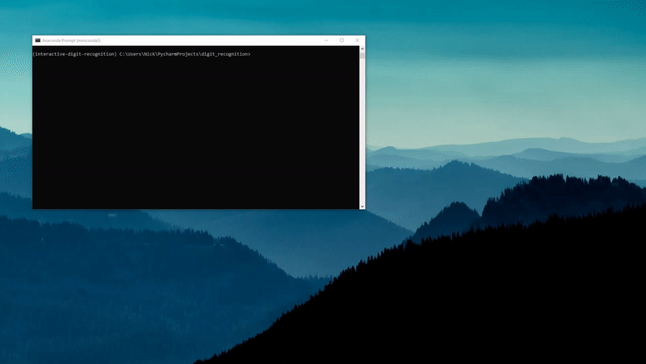

# Interactive Digit Recognition
A small showcase which combines [pygame](https://www.pygame.org/news) and [keras](https://keras.io/) to recognize 
digitally written digits.




## Installation
To install the program, simply clone the github repository to the desired directory:

```
git clone https://github.com/nickhir/interactive-digit-recognition.git

cd interactive-digit-recognition
```
To create an enviroment which contains all required packages run
```
conda env create -f environment.yml
conda activate interactive-digit-recognition
```

Afterwards you can start the program by running `python main.py`
 


